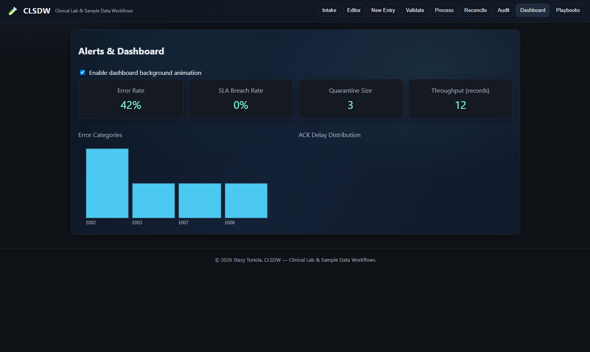
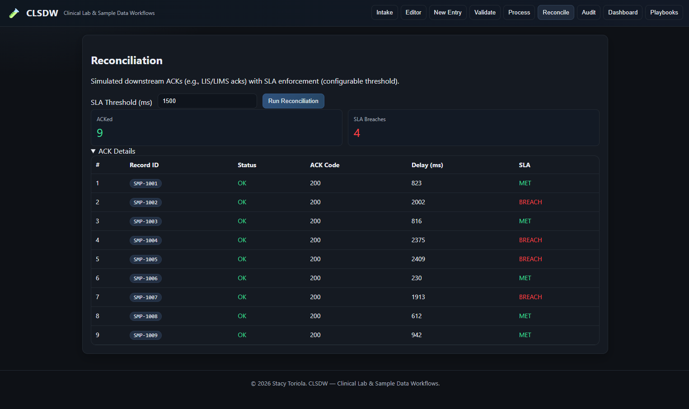
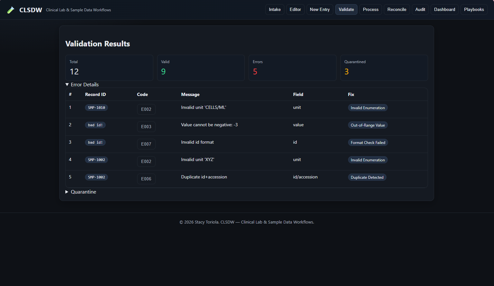
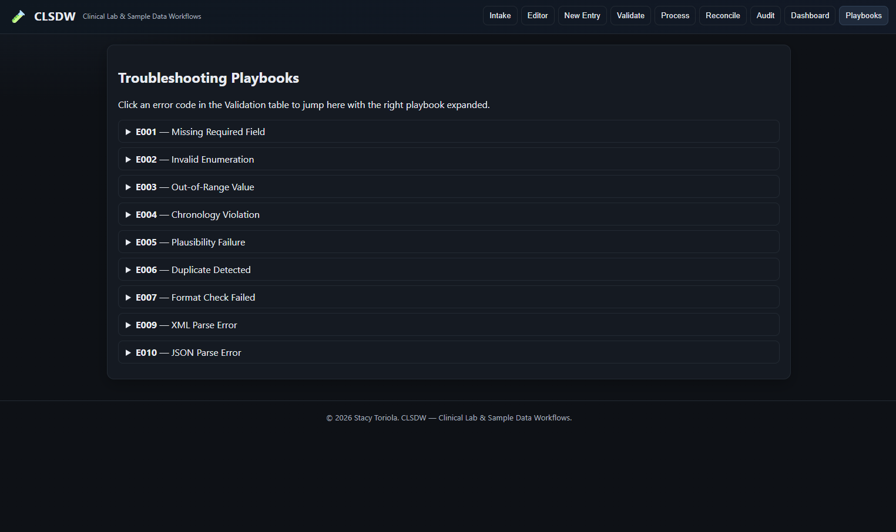

# clinical-lab-data-workflows-concept
CLSDW—Clinical Lab &amp; Data Workflows—is a concept coded by Stacy T. that unifies clinical lab processes and data into traceable workflows. It provides public working examples in HTML, JSON, and XML on GitHub, plus a full Python implementation

## Dashboard Overview

## Reconciliation / SLA Breach Status

## Validation Result

## Troubleshoot Index

